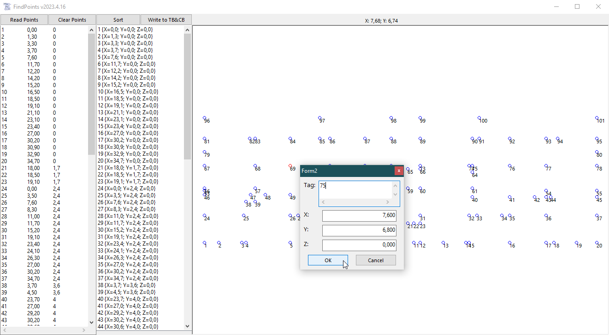

# G2D_FindPoints  
## edit point nrs/tags  

 

Project started in april 2023.  
Maybe you know the following situation: 
You have a bunch of points just coordinates as text strings coming maybe from excel.
But you can not allocate them to other data, because you don't have the right point-nrs for the data.
But you have a picture where you can visually see the point-nrs, so you could do it if you only you had the one tool...  
Now here comes the solution, copy the point-data to clipboard, click the Read-button, click a certain point in the view and edit the tag/point-nr. do so for all points.
Now sort the points due to point-nr and finally write the data back to clipboard where you are able to import the data back into excel.

[Link text Here](https://link-url-here.org) 

